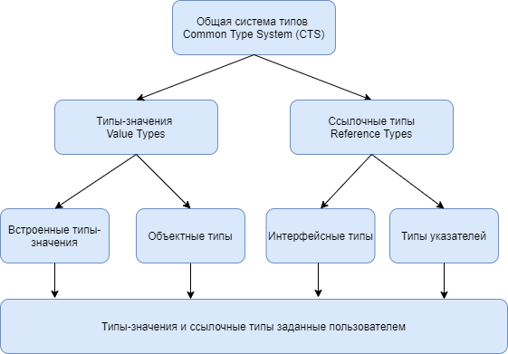

# Типы в .NET

### Иерархия типов в C#:


### Типы значений и ссылочные типы
* Значимые типы: живут в стеке.
* Ссылочные типы: живут в куче.


* При присвоении объект значимого типа получает копию данных. 
* Объект ссылочного типа получает ссылку на объект в куче.


* При изменении объекта ссылочного типа, меняются все объекты, имеющие на него ссылку.
* При изменении объекта значимого типа меняется только сам объект.


### Классы
**Классы** – ссылочные типы.

Класс может содержать такие члены как: [поля](https://docs.microsoft.com/ru-ru/dotnet/csharp/programming-guide/classes-and-structs/fields), [свойства](https://docs.microsoft.com/ru-ru/dotnet/csharp/programming-guide/classes-and-structs/properties), [конструкторы](https://docs.microsoft.com/ru-ru/dotnet/csharp/programming-guide/classes-and-structs/constructors), [статические и экземплярные методы](https://docs.microsoft.com/ru-ru/dotnet/csharp/programming-guide/classes-and-structs/methods).
**Поле** - переменная любого типа, которая объявлена непосредственно в классе или структуре. Поля являются членами содержащих их типов.

```cs
public class Person
 {
     // приватное поле
     private DateTime _dateOfBirdth;
     // публичное поле (обычно не рекомендуется)
     public string Name;
 }
```

**Свойство** — это член, предоставляющий гибкий механизм для чтения, записи или вычисления
значения частного поля. Свойства можно использовать, как если бы они были членами общих
данных, но фактически они представляют собой специальные методы, называемые методами
доступа. Это позволяет легко получать доступ к данным и помогает повысить безопасность и
гибкость методов.

```cs
public class Person
 {
     private DateTime _dateOfBirdth;

     public int Age
     {
        get { return DateTime.Now - _dateOfBirdth; }
        set 
        {
            if(value < 0) throw new ArgumentOutOfRangeException($"{nameof(value)} must be greater than 0");
            _dateOfBirdth = value;
        }
     }
 }
```

**Конструктор** — это метод, имя которого совпадает с именем его типа. Его сигнатура содержит только
имя метода и список параметров. Сигнатура не содержит возвращаемый тип.

``` cs
public class Person
{
     private string _firstName;
     private string _lastName;

     public Person(string firstName, string lastName)
     {
        _firstName = firstName;         
        _lastName = lastName;  
     }
}
```

Если не предоставить конструктор для класса, C# создаст конструктор по умолчанию, который создает
экземпляр объекта и задаст переменным-членам значения по умолчанию, как показано в [Таблице
значений по умолчанию](https://docs.microsoft.com/ru-ru/dotnet/csharp/language-reference/keywords/default-values-table).
Конструктор класса вызывается с помощью оператора [new](https://docs.microsoft.com/ru-ru/dotnet/csharp/language-reference/operators/new-operator).
`MyClass mc = new MyClass();`

Когда вы объявляете переменную ссылочного типа, такая переменная будет содержать
значение NULL, пока вы явным образом не создадите экземпляр класса с помощью оператора
new или не назначите его объекту совместимого типа.

### Приведение типов
Поскольку код C# является статически типизированным во время компиляции, после объявления
переменной ее нельзя объявить повторно или назначить ей значения другого типа, если этот тип
невозможно неявно преобразовать в тип переменной. Например, string невозможно неявно
преобразовать в int.

Существует несколько видов преобразований типов:

* **Неявные преобразования.** Специальный синтаксис не требуется, так как преобразование
является строго типизированным и данные не будут потеряны. Примеры включают
преобразования из меньших в большие целочисленные типы и преобразования из
производных классов в базовые классы.

* **Явные преобразования (приведения).** Для явных преобразований требуется оператор
приведения. Приведение требуется, если в ходе преобразования данные могут быть утрачены
или преобразование может завершиться сбоем по другим причинам. Типичными примерами
являются числовое преобразование в тип с меньшей точностью или меньшим диапазоном и
преобразование экземпляра базового класса в производный класс.

* **Пользовательские преобразования.** Такие преобразования выполняются специальными
методами, которые можно определить для включения явных и неявных преобразований между
пользовательскими типами без связи "базовый класс — производный класс".

* **Преобразования с использованием вспомогательных классов.** Чтобы выполнить
преобразование между несовместимыми типами, например целыми числами и
объектами [System.DateTime](https://docs.microsoft.com/ru-ru/dotnet/api/system.datetime) или шестнадцатеричными строками и массивами байтов, можно
использовать классы [System.BitConverter](https://docs.microsoft.com/ru-ru/dotnet/api/system.bitconverter) и [System.Convert](https://docs.microsoft.com/ru-ru/dotnet/api/system.convert), а также методы Parse встроенных
числовых типов, такие как [Int32.Parse](https://docs.microsoft.com/ru-ru/dotnet/api/system.int32.parse).

Полный список всех неявных числовых преобразований: [Таблица неявных числовых преобразований](https://docs.microsoft.com/ru-ru/dotnet/csharp/language-reference/keywords/implicit-numeric-conversions-table).
Для ссылочных типов неявное преобразование всегда предусмотрено из класса в любой из его
прямых или косвенных базовых классов или интерфейсов. Никакой специальный синтаксис не
требуется, поскольку производный класс всегда содержит все члены базового класса.

    Derived d = new Derived();
    Base b = d; // Always OK. 

Список разрешенных явных числовых преобразований: [Таблица явных числовых преобразований](https://docs.microsoft.com/ru-ru/dotnet/csharp/language-reference/keywords/explicit-numeric-conversions-table).
Для ссылочных типов явное приведение является обязательным, если необходимо преобразовать
базовый тип в производный тип:

```cs
    // Создаем экземпляр производного типа.
    Giraffe g = new Giraffe();
    
    // Неявное приведение к базовому типу безопасно.
    Animal a = g;
    
    // Явное приведение требуется, чтобы привести обратно
    // к производному типу. ВАЖНО: Этот код скомпилируется
    // но выбросит исключение во время исполнения
    // если объект справа на самом деле не жираф.
    Giraffe g2 = (Giraffe) a; 
```

### Операторы *is* и *as*
В некоторых преобразованиях ссылочных типов компилятор не может определить, будет ли
приведение допустимым. Есть вероятность, что правильно скомпилированная операция приведения
завершится сбоем во время выполнения. C# предоставляет операторы is и as для проверки
определенного типа значения.
Оператор is проверяет, совместим ли тип среды выполнения для результата определенного
выражения с указанным типом. Начиная с C# версии 7.0, оператор is также проверяет соответствие
результата выражения указанному шаблону. Выражение с оператором проверки типа is имеет
следующий вид:
`E is T`
где E представляет выражение, возвращающее значение, а T содержит имя или параметр типа.
Оператор as явным образом преобразует результат выражения в указанный ссылочный или
поддерживающий значения NULL тип. Если такое преобразование невозможно,
оператор as возвращает значение null. В отличие от [оператора приведения ()](https://docs.microsoft.com/ru-ru/dotnet/csharp/language-reference/operators/type-testing-and-cast#cast-operator-),оператор as никогда не
создает исключения.


### Nullable типы
Значение null по умолчанию могут принимать только объекты ссылочных типов. Однако в различных
ситуациях бывает удобно, чтобы объекты числовых типов данных имели значение null, то есть были
бы не определены. Стандартный пример - работа с базой данных, которая может содержать значения
null. И мы можем заранее не знать, что мы получим из базы данных - какое-то определенное
значение или же null. На помощь приходят [Nullable типы](https://docs.microsoft.com/ru-ru/dotnet/csharp/programming-guide/nullable-types/).
Для объявления надо использовать знак вопроса ? после значимого типа:
```cs
    int? z = null;
    bool? enabled = null;
```
Фактически запись ? является упрощенной формой использования структуры System.Nullable<T>.
Параметр T в угловых скобках представляет универсальный параметр, вместо которого в конкретной 
задача уже подставляется конкретный тип данных. Следующие виды определения переменных будут
эквивалентны:
```cs
    int? z1 = 5;
    bool? enabled1 = null;
    Double? d1 = 3.3;
    Nullable<int> z2 = 5;
    Nullable<bool> enabled2 = null;
    Nullable<System.Double> d2 = 3.3;
```
Для всех типов Nullable определено два свойства: Value, которое представляет значение объекта, и
HasValue, которое возвращает true, если объект Nullable хранит некоторое значение.

### Неявная типизация
Для неявной типизации вместо названия типа данных используется ключевое слово [var](https://docs.microsoft.com/ru-ru/dotnet/csharp/language-reference/keywords/var). Затем уже
при компиляции компилятор сам выводит тип данных исходя из присвоенного значения.
1. Нельзя сначала объявить неявно типизируемую переменную, а затем инициализировать.
2. Если тип результата нельзя определить, то компилятор выдаст ошибку.


### Упаковка и распаковка
Упаковка представляет собой процесс преобразования типа значения в тип object или в любой другой
тип интерфейса, реализуемый этим типом значения. Когда тип значения упаковывается средой CLR,
он инкапсулирует значение внутри экземпляра System.Object и сохраняет его в управляемой куче.
Операция распаковки извлекает тип значения из объекта. Упаковка является неявной; распаковка
является явной. Понятия упаковки и распаковки лежат в основе единой системы типов C#, в которой
значение любого типа можно рассматривать как объект.
```cs
    int i = 123;
    // Упаковка i.
    object o = i;
    o = 123;
    i = (int)o; // распаковка
```
По сравнению с простыми операциями присваивания операции упаковки и распаковки являются
весьма затратными процессами с точки зрения вычислений.

### Передача параметров в метод
Существует два способа передачи параметров в метод в языке C#: по значению и по ссылке.
При передаче по значению метод получает не саму переменную, а ее копию. А при передаче
параметра по ссылке метод получает адрес переменной в памяти. И, таким образом, если в методе
изменяется значение параметра, передаваемого по ссылке, то также изменяется и значение
переменной, которая передается на его место.