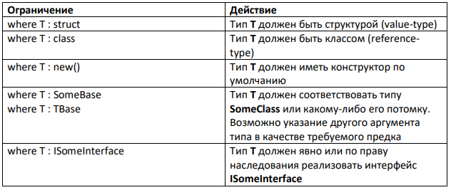

# Обобщения (Generics)

### Введение
Обобщения позволяют создать параметризованные классы, методы, структуры, делегаты и интерфейсы, которые позволяют внутри себя обрабатывать разные типы данных.
До появления обобщений в C# всегда имелась возможность создавать обобщенный код оперируя ссылками типа object, так как класс object является базовым для всех типов (по ссылке типа object можно обращаться к объекту любого типа). Но, в таком коде трудно было соблюсти типовую безопасность, посколько для преобразования типа object в конкретный тип данных требовалось приведение типов. Также, использование подобного способа обобщения кода со значимыми типами приводит к упаковке (boxing) / распаковке (unboxing), что существенно снижает производительность приложения. Boxingпреобразование значимого типа (хранится в Stack) в ссылочный тип (хранится в Heap).
Unboxing, соответственно наоборот.
Подводя итог, можно выделить основные преимущества использовании обобщений:
* Производительность. Не происходят операции boxing/unboxing, например, при использовании обощенных коллекций.
* Безопасность. Обобщения автоматически обеспечивают типовую безопасность. Никаких приведений типов.
* Повторное использование кода для разных типов данных.
[Видео про работу с обобщениями](https://www.youtube.com/watch?v=xOQnDqf8N-I&t=971s):

### Виды обобщений
* Обобщённые методы:
```cs
void WriteTArr<T>(T arr){ }
```
* Обобщённые типы (классы и структуры):
```cs
    class MyList<T>
    struct Pair<TKey, TValue>
```
* Обобщённые интерфейсы:
```cs
    interface IDrawable<T>
```
* Обобщённые делегаты:
```cs
    delegate void DoSomething<T>(T x, T y);
```
* Пример generic-класса:
```cs
    public class Person<T>
    {
    public T Id { get; set; }
    public string Name { get; set; }
    }
```
* Пример использования класса:
```cs
    var personWithLongId = new Person<long>();
    personWithLongId.Id = 4;
    var personWithGuidId = new Person<Guid>();
    personWithGuidId.Id = Guid.NewGuid();
```

### Рекомендации по именованию
Имена обобщеных типов должны начинаться с буквы T.
Если обобщённый тип может быть замёнен любым классом и используется только один обобщенный тип, T – вполне подходящее имя:

```cs
    public class List<T> { }
```
Если к обобщенному типу предъявляются специальные требования (ограничения), либо используется два и более обобщённых типа, то в качестве параметра следует применять осмысленные имена типов:
```cs
    public class PersonInfo<TAccount, TProvider>
    {
        public string Name { get; set; }
        public int Age { get; set; }
        public TAccount AccountInfo { get; set; }
        public TProvider Provider { get; set; }
    }
```

### Ограничения обобщений
Перечень действий, допустимых с объектами аргумента обобщённого типа, определяется
ограничениями, наложенными на этот аргумент. По умолчанию аргумент разрешает
использование только функционала класса object. Поэтому в приведённом ниже коде,
компилятор не знает как сравнить два параметра.
* **Без ограничения**
```cs
    T Max<T>(T x, T y)
    {
        // Error: Operator '>' cannot be applied to operands of type 'T' and 'T'
        return x > y ? x : y;
    }
```

Расширение возможностей достигается путём явного ограничения (конкретизации) типа-аргумента:

* **С ограничением**
```cs
    T Max<T>(T x, T y) where T : IComparable<T>
    {
        return x.CompareTo(y) > 0 ? x : y;
    }
```
Конкретизировав универсальный тип, мы можем использовать поля и методы этого типа в
коде. Для этого используется следующий синтаксис:
`where шаблон : список_ограничений`



Если ограничений несколько, они должны указываться через запятую.

Несколько важных моментов об ограничении **new()**:
* его можно использовать вместе с другими ограничениями, но последним по порядку;
* ограничение new() позволяет конструировать объект, используя только конструктор
без параметров;
* ограничение new() нельзя использовать одновременно с ограничением типа значения.


### Значения по умолчанию
Иногда возникает необходимость указать некоторое начальное значение, в том числе и
null. Напрямую это сделать мы не можем:
```cs
    T id = null;
```
Для этого нужно использовать оператор **default(T)** – позволяет получить значение по
умолчанию для любого типа (в том числе аргумента обобщённого типа):
```cs
    T id = default(T);
```
Оператор возвращает значение по умолчанию в зависимости от типа:
* 0 для числовых типов;
* false для bool;
* \0 для символов;
* null для объектов классов и структур Nullable.


### Статические члены в обобщениях
Статические поля обобщённых типов реализуются независимо в каждом закрытом
обобщении.
```cs
    class Account<T>
    {
        public static T session;
    }

    Account<int> account1 = new Account<int>();
    Account<int>.session = 5436;

    Account<string> account2 = new Account<string>();
    Account<string>.session = "45245";

    Console.WriteLine(Account<int>.session); // 5436
    Console.WriteLine(Account<string>.session); // 45245
```
### Немного о вариативности.

#### Вариативность обобщений
В версии C# 4.0 добавилась возможность использования **ковариантности** и
**контрвариантности** для параметров обобщённого типа для обобщённых интерфейсов и
делегатов.
* **Ковариантность** служит средством, разрешающим методу возвращать тип, производный
от класса, указанного в параметре типа. В прошлом возвращаемый тип должен был в
точности соответствовать параметру типа в силу строгой проверки обобщений на
соответствие типов. Использование ковариантности смягчает это правило.
Параметр ковариантного типа объявляется с помощью ключевого слова out, которое
предваряет имя этого параметра.

```cs
    // Пример использования ковариантности в интерфейсе
    public interface IMyInfo<out T>
    {
        T GetObject();
    }
```

Метод GetObject() может возвращать ссылку на обобщенный тип T или же ссылку на любой класс, производный от типа Т. Ковариантность параметра типа может
распространяться только на тип, возвращаемый методом.
Пример:

```cs
    List<string> strings = new List<string>();
    strings.Add("test");
    IEnumerable<object> objects = strings; // т.к. IEnumerable<out T>
```

* **Контравариантность** служит средством, разрешающим методу использовать аргумент,
тип которого относится к базовому классу, указанному в соответствующем параметре
типа. В прошлом тип аргумента метода должен был в точности соответствовать параметру
типа в силу строгой проверки обобщений на соответствие типов. Контравариантность
смягчает это строгое правило.
Параметр контравариантного типа объявляется с помощью ключевого слова in, которое
предваряет имя этого параметра.

```cs
    // Обобщенный интерфейс, поддерживающий контравариантность.
    public interface IContractor<in T>
    {
        void Show(T obj);
    }
```
Параметр контравариантного типа можно применять только к аргументам методов.
Метод Show в качестве параметра может принимать ссылку на обобщённый тип T или же
ссылку на любой класс-предок для типа T.

* **Объяснение ковариации и контрвариации на примерах**
    * https://ru.stackoverflow.com/questions/516687

* **Дополнительные материалы:**
    * https://metanit.com/sharp/tutorial/3.12.php
    * https://professorweb.ru/my/csharp/charp_theory/level11/11_1.php