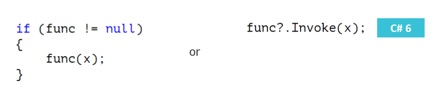
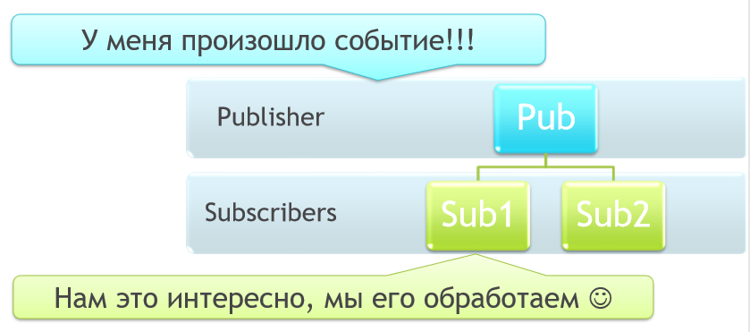

# Делегаты

Делегат – это структура данных, описывающая сигнатуру какого-либо метода (набор и способ передачи принимаемых методом аргументов, и тип возвращаемого значения).
Экземпляр делегата представляет собой ссылку на конкретный метод (конкретного экземпляра, либо статический), сигнатура которого соответствует делегату.
Экземпляр делегата даёт возможность оперировать методами как объектами:

* хранить в переменных;
* передавать их в качестве аргументов.

Вызов метода, присвоенного делегату, разрешается во время выполнения, а не в процессе компиляции.

### Объявление делегата
[<спецификатор доступа>] **delegate** <тип результата> <имя делегата>( [<перечень параметров>] )

Пример объявления делегата:
```csharp
namespace DelegatesExample
{
	// Делегат, объявленный в пространстве имён
	public delegate double Function(double x);
	class MyClass
	{
		// Делегат, объявленный внутри класса
		private delegate void ArrayProcessor(double[] arr);
	}
}
```
Пример использования делегата:
```csharp
delegate double Function(double x);

static double Square(double x)
{
	return x * x;
}

static void Main(string[] args)
{
	// Создание экземпляра делегата
	Function func1 = new Function(Square);
	// Более сокращенная запись
	Function func2 = Square;
	// Вызов метода делегата
	double result1 = func1.Invoke(6.28);
	// Сокращённая форма вызова делагата.
	double result2 = func1(6.28);
}
```
**Делегаты строго типизированы**. Если возвращаемый тип или набор параметров у метода отличаются от тех, с которыми объявлен делегат, то такой метод нельзя добавить в делегат. Во внимание также принимаются модификаторы **ref** и **out**.

### Безопасный вызов делегата

Делегат не содержащий ссылки на метод, равен **null**. Если вызвать такой (пустой) делегат, то произойдёт **NullReferenceException**. Поэтому перед вызовом делегата необходимо <u>**всегда**</u> проверять его на **null** или использовать null-безопасный вызов метода.



### Добавление и удаление методов из делегата

Делегат может ссылаться не только на один метод, но и на множество методов с одинаковой сигнатурой. Все методы в делегате попадают в специальный список вызова – ``invocation list``. При вызове такого делегата все методы из этого списка вызываются последовательно в порядке, соответствующем порядку добавления. Если при выполнении этого списка происходит ошибка, выбрасывается исключение.
Для реализации этого достаточно получить экземпляр делегата, а затем добавить методы в цепочку с помощью оператора + или +=. Для удаления метода из цепочки служит оператор - или -=. Если делегат возвращает значение, то им становится значение, возвращаемое последним методом в списке вызовов. Поэтому делегат, в котором используется групповая адресация, обычно имеет
возвращаемый тип void.
Также для добавления и удаления методов в делегате можно использовать статические методы класса **Delegate**: **Combine** и **Remove()/RemoveAll()** соответственно.

```cs
delegate void Message();

static void Main(string[] args)
{
	// Вариант 1
	Message messages = Message_One;
	messages += Message_Two;
	// Вариант 2
	Message message_1 = Message_One;
	Message message_2 = Message_Two;
	Message messages_2 = (Message) Delegate.Combine(message_1, message_2);
	messages();
	// Output:
	// Message one.
	// Message two.
}
```

Цепочки вызовов являются весьма эффективным механизмом, поскольку они позволяют определить ряд методов, выполняемых единым блоком. Кроме того, цепочки вызовов имеют особое значение для обработки событий.

### Ковариантность и контравариантность делегатов

Метод, передаваемый делегату, должен иметь такой же возвращаемый тип и сигнатуру, как и делегат. В отношении производных типов это правило не такое строгое благодаря ковариантности и контравариантности.
Ковариантность позволяет присвоить делегату метод, возвращаемым типом которого служит класс, производный от класса, указываемого в возвращаемом типе делегата.
Контравариантность позволяет присвоить делегату метод, типом параметра которого служит класс, являющийся базовым для класса, указываемого в объявлении делегата.

```csharp
delegate Parent Function(Child model);

public static Parent MethodWithParent(Parent model)
{
	return model;
}

public static Child MethodWithChild(Child model)
{
	return model;
}

static void Main(string[] args)
{
	// Пример ковариантности
	// Можно использовать метод, возвращаемым типом параметра которого
	// является производный класс
	Function func = MethodWithChild;
	// Пример контравариантности
	// Можно использовать метод, аргументом которого является
	// базовый класс
	func = MethodWithParent;
}
```

Ковариантность и контравариантность делегатов находит довольно широкое применение при реализации событий.

### Стандартные делегаты

Вместо определения нового типа делегата с каждым типом параметра и возврата можно использовать стандартные делегаты: **Action\<>**, **Func\<>**, **Predicate\<in T>**.

* **Action\<>**
  * Принимает: набор аргументов (от 0 до 16).
  * Возвращает: **void**.

* **Func\<>**
  * Принимает: набор аргументов (от 0 до 16).
  * Возвращает: значение указанного типа.

* **Predicate\<in T>**
  * Принимает: один аргумент указанного типа.
  * Возвращает: **bool**.

Пример применения:

```csharp
public static void ProcessArray<T>(T[] array, Func<T, T> processor)
{
	if (processor == null)
	{
		throw new ArgumentNullException(nameof(processor));
	}
    
	for (int i = 0; i < array.Length; i++)
	{
		array[i] = processor(array[i]);
	}
}
```

Подробнее:
https://professorweb.ru/my/csharp/charp_theory/level10/10_4.php

### Анонимные функции

Если метод, кроме как для передачи в делегат, самостоятельно нигде не вызывается (вызывается только посредством делегата), то имеет смысл объявить такой метод через анонимную функцию.
Анонимная функция – это inline-оператор или выражение, которое можно использовать в качестве объекта делегата.
Существуют две формы записи анонимных функций:

* Анонимные методы

```csharp
Function plusOne = delegate(double x) { return x + 1; };
```

* Лямбда выражения

```csharp
Function plusOne = (x) => x + 1;
```

# События

События позволяют издателю (Publisher) уведомлять подписчиков (Subscribers) о возникновении каких-либо ситуаций.



Класс, вызывающий событие, называется издателем, а классы, обрабатывающие его, - подписчиками.

* Издатель определяет момент вызова события, подписчики определяют предпринятое ответное действие.

* У события может быть несколько подписчиков. Подписчик может обрабатывать несколько событий от нескольких издателей.

* Если событие имеет несколько подписчиков, то при его возникновении происходит синхронный вызов обработчиков событий.

* Если подписчиков нет, вызов события не имеет смысла и не может быть произведён.

* В библиотеке классов .NET Framework в основе событий лежит делегат EventHandler и базовый класс EventArgs.

### Объявление и генерация события

[<спецификатор>] **event** <делегат> <имя события>;

```csharp
public event EventHandler<EventArgs> Came;

protected virtual void OnCame()
{
	if (Came != null)
	{
		Came(this, EventArgs.Empty);
	}
}
```

Стандартные делегаты для событий:

```csharp
public delegate void EventHandler(object sender, EventArgs e);
public delegate void EventHandler<T>(object sender, T e);
```

**EventArgs** представляет базовый класс для содержания дополнительной информации о событии.
Подписка обработчика на событие синтаксически аналогична добавлению метода обработчика в список вызовов группового делегата.

```csharp
hugo.Came += Hugo_Came;
```

Обработчик представляет собой метод, соответствующий сигнатуре делегата события.

```csharp
static void Hugo_Came(object sender, EventArgs e)
{
	Console.WriteLine("Hugo came");
}
```

### Отличие событий от публичных объектов делегатов

Возможность управления подпиской:

```csharp
public event EventHandler<EventArgs> Came
{
	add { /* manual subscription */ }
	remove { /* manual unsubscription */ }
}
```

Возможность описания событий в интерфейсах:

```csharp
interface IEmployee
{
	event EventHandler<EventArgs> Came;
}
```

Событие инкапсулирует объект делегата, как свойство инкапсулирует поле.

Дополнительные материалы:
https://docs.microsoft.com/ru-ru/dotnet/standard/events/